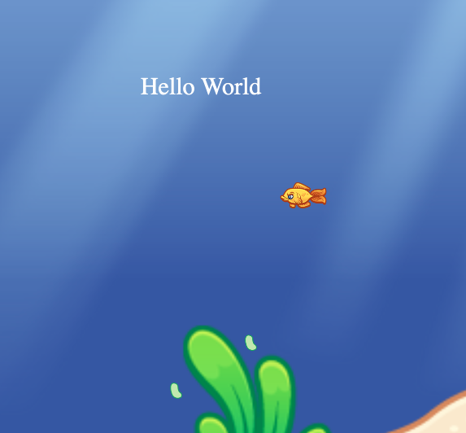

# Phaser Fish Game!

A little browser game make with [Phaser](https://phaser.io/phaser3)!

 

# Origin
This game was initially created by [Jim Lynch](https://github.com/JimLynchCodes), a software engineer who started his career as an Actionscript3 programmer and Flash game developer. He slowly moved over to JavaScript and other interesting programming languages over the years and found himself building lots and lots of software that wasn't games. 😢 

During the Covid-19 outbreak Jim decided to get back into 2D game development, and he aspired to make a cool multiplayer game similar to the agar.io browser game. He also had fond memories of games like [Feeding Frenzy](https://kbhgames.com/game/feeding-frenzy) and [Adventure Aquarium](https://play.google.com/store/apps/details?id=com.socialin.android.game.fishadventure&hl=en_US) and so decided to build an underwater themed "eat the smaller fish and don't get eaten by the bigger fish" style game!

 

# Plans

## Single Player Mode
The first goal is to just have a working single-player game where you can eat smaller fish and get eaten by bigger fish. In this game we can work out the main game mechanics and tweak the physics to maximize the amount of fun the users get when playing it!

## Online Mode
After we have a fun single-player game, let's build an online mode similar to make it similar to the agar.io game! This will make it even more fun and awesome! 🔥

## Donate Profits To Charity
Like agar.io, we can have subtle adverts on the start screen to fund the cost of our servers. We can put the profits towards charities that support things we care about, such as:

- Preservation of habitats for marine wildlife. &nbsp; 🐠

- Benefiting the environment and wildlife in general. &nbsp; 🌏

- Teaching people to code and program computers. &nbsp; 💻

- Promoting game development, game design, and animation. &nbsp; 👾

 

# Current State

We've got a long way to go until this game is ready to release to users! Here's a screenshot of the current state as of April 5th, 2020.

Here are different features that we're building and whether they have been fully implemented:

Features:

- [✓] &nbsp; control a fish that swims around based on mouse cursor.

- [ &nbsp; ] &nbsp; make background look nice

- [ &nbsp; ] &nbsp; Give player the ability to "boost" with spacebar.

- [ &nbsp; ] &nbsp; choose different fish to play as?

- [ &nbsp; ] &nbsp; Add walls that the fish cannot swim through

- [ &nbsp; ] &nbsp; tweak hit box of fish to be smaller than rectangular image bounds.

- [ &nbsp; ] &nbsp; buy different fish / accessories (like hats, clothes, etc.) 

 

# Get Involved
This is an open-source project, and we'd love you have you on board and helping to steer the direction of this game! The best way to get started is to clone this project and poke around. The README file within the `phaser-fish` directory contains more technical directions on how to build and run the source code.

Also, join our chatroom to see what everyone is working on and learn how to can best help the team!

 

# Join the Chatroom!
Our main point of communication is the [EverybodyCodes Slack Group](https://join.slack.com/t/everybodycodes/shared_invite/zt-d1uo3ra9-kkz4R08kI1Tv6dFNRU5Olw). It's open to everyone so just click on the link and join in!

Once you're in, join the `phaser-fish-game` channel and say hi!
